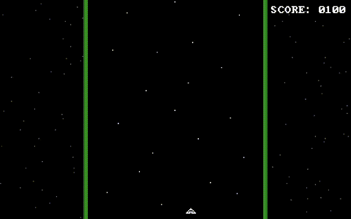

# Universe Intruders

A simple Space Invaders-like game made with SFML.Net. I made this for my year 10 computing project in 2020, so don't expect the code quality to be anything incredible, I may work on it some more and improve it eventually if I have time to.

## Setup Guide
You will need these things:
- A computer. Preferably running Linux or Windows, I don't have a Mac to test it on 
- Dotnet SDK with the CLI tools
- SFML and CSFML libraries if you are running Linux. on Windows these are included with SFML.Net

Then follow these steps:
1. Restore the C# project dependencies: `dotnet restore`
2. Build or run the project: `dotnet build` or `dotnet run`
3. Have fun playing (if you want to)

## Font Attribution
The font used in this game is "IBM BIOS" by VileR, which can be found [here](https://int10h.org/oldschool-pc-fonts/)
